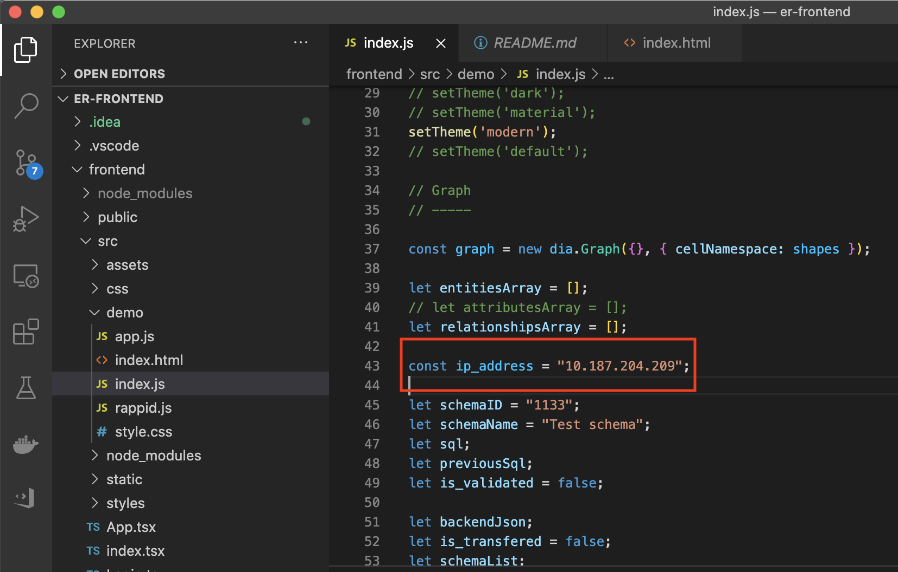
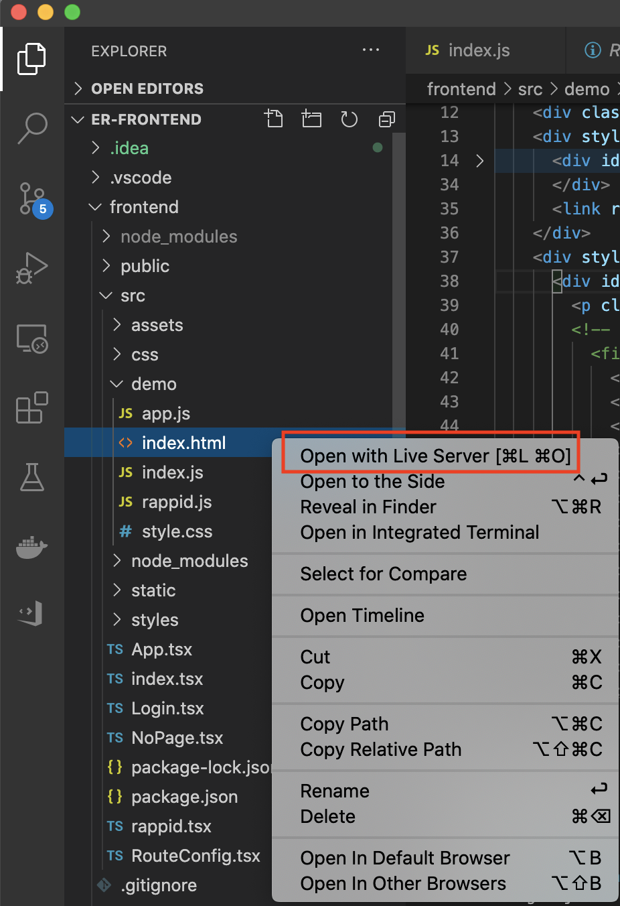

# ER Frontend

This is the front-end application of the ER API project, which is a simple
html-javascript application

## Getting started

Download this sub-project using the following command line:
```
git clone https://github.com/BoanZhu/ER-Frontend.git
```

After opening this project in the editor such as Vscode, you need to
modify the "ip_address" variable inside the file "frontend/src/demo/index.js".
The "ip_address" should be the ip address of your back-end application.

(Back-end application link: https://gitlab.doc.ic.ac.uk/bz2818/er-backend)

The following figure shows this step:



Then you can run the front-end page application as the following example:


